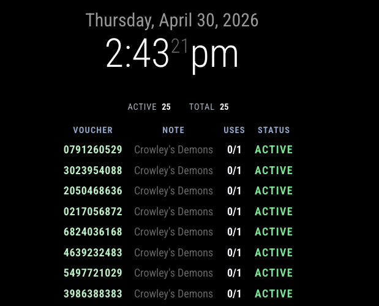

# MMM-UniFiHotspotVouchers

A [MagicMirror²](https://github.com/MagicMirrorOrg/MagicMirror)  module for displaying UniFi hotspot vouchers from a UniFi OS console running the Network application.

## Features

- Logs into UniFi OS with a local admin account
- Pulls hotspot vouchers from the Network application
- Tries the current UniFi OS proxy endpoints first, then falls back to legacy Network app paths
- Shows voucher code, note, usage, and status
- Supports optional compact mode, masking voucher codes, and inactive voucher display
- Refreshes on a configurable interval

## Screenshot



## Prerequisites

1. A working MagicMirror² installation.
2. A UniFi OS console such as a Cloud Key, UDM, or similar device.
3. A local UniFi OS username and password with permission to read Network data.

## Installation

MMPM is optional. You can use the standard Git method below without MMPM.

If you want to use MMPM commands, install MMPM first by following the official instructions:
https://github.com/Bee-Mar/mmpm

### Option 1: Standard Install (Git)

From your MagicMirror `modules` folder:

```bash
git clone https://github.com/rroach3753/MMM-UniFiHotspotVouchers.git
cd MMM-UniFiHotspotVouchers
npm install
```

If you copied this folder manually, place it at:

```text
MagicMirror/modules/MMM-UniFiHotspotVouchers
```

### Option 2: Install with MMPM (MagicMirror Package Manager)

If you use MMPM, install with:

```bash
mmpm install MMM-UniFiHotspotVouchers
```

## Updating

### Option 1: Standard Update (Git)

From your module folder:

```bash
cd MagicMirror/modules/MMM-UniFiHotspotVouchers
git pull
npm install
```

### Option 2: Update with MMPM

```bash
mmpm update MMM-UniFiHotspotVouchers
```

## Example Config

Add this to your `config/config.js` file:

```js
{
  module: "MMM-UniFiHotspotVouchers",
  position: "top_right",
  config: {
    title: "Hotspot Vouchers",
    controllerUrl: "https://unifi.local",
    username: "admin",
    password: "YOUR_PASSWORD",
    apiKey: "",
    apiKeyHeader: "X-API-Key",
    authMode: "auto",
    site: "default",
    verifySSL: false,
    refreshInterval: 300000,
    showInactive: false,
    showSummary: true,
    showNotes: true,
    showCreatedAt: false,
    showVoucherCode: true,
    maskVoucherCode: false,
    sortBy: "created",
    maxRows: 12,
    compact: false,
    showBorders: true,
    showBackground: true,
  },
},
```

## Configuration Options

You need either local username/password credentials or an API key path:

- `username` and `password` are required when using local login.
- `apiKey` is required when using API-key mode.

All other settings are optional and fall back to the defaults shown below.

| Option | Type | Required? | Default | What it does |
| --- | --- | --- | --- | --- |
| `title` | String | No | `UniFi Hotspot Vouchers` | Title shown above the voucher table. |
| `controllerUrl` | String | No | `https://unifi.local` | Base URL for the UniFi OS console. Use your Cloud Key IP or hostname. |
| `username` | String | No | `""` | UniFi OS username used for login. Required when `authMode` is `login` or when `authMode` is `auto` and API-key access is not available. |
| `password` | String | No | `""` | UniFi OS password used for login. Required when `authMode` is `login` or when `authMode` is `auto` and API-key access is not available. |
| `apiKey` | String | No | `""` | Optional API key used when the console exposes voucher endpoints through a UniFi API path. Required when `authMode` is `apikey`. |
| `apiKeyHeader` | String | No | `X-API-Key` | Header name used when sending the API key. |
| `authMode` | String | No | `auto` | Authentication mode: `auto`, `apikey`, or `login`. Auto tries API key first when present, then falls back to login if credentials are configured. |
| `site` | String | No | `default` | Network application site name. Most single-site deployments use `default`. |
| `verifySSL` | Boolean | No | `false` | Set to `true` to enforce TLS certificate validation. Leave `false` for self-signed local certs. |
| `refreshInterval` | Number | No | `300000` | How often the module refreshes voucher data, in milliseconds. |
| `showInactive` | Boolean | No | `false` | Shows inactive, disabled, and used vouchers instead of only active ones. |
| `showSummary` | Boolean | No | `true` | Shows the summary chips for active and total vouchers. |
| `showNotes` | Boolean | No | `true` | Shows the voucher note/label column. |
| `showCreatedAt` | Boolean | No | `false` | Shows the voucher creation timestamp column. |
| `showVoucherCode` | Boolean | No | `true` | Shows the voucher code column. |
| `maskVoucherCode` | Boolean | No | `false` | Masks voucher codes in the table instead of showing the full code. |
| `sortBy` | String | No | `created` | Sort order for vouchers. Use `created` or `code`. |
| `maxRows` | Number | No | `12` | Maximum number of voucher rows shown. |
| `compact` | Boolean | No | `false` | Uses tighter spacing and smaller table padding. |
| `showBorders` | Boolean | No | `true` | Shows or hides the border and shadow around the voucher card. |
| `showBackground` | Boolean | No | `true` | Shows or hides the translucent card background behind the voucher table. |
| `emptyMessage` | String | No | `No hotspot vouchers found.` | Message shown when no vouchers match the current filter. |
| `loadingMessage` | String | No | `Loading UniFi vouchers...` | Message shown while the first fetch is in progress. |

## Notes

- The module first tries UniFi OS proxy endpoints such as `/proxy/network/api/s/default/rest/hotspot/voucher`.
- If that fails, it falls back to the older Network app endpoints such as `/api/s/default/stat/voucher`.
- If you provide `apiKey`, the module will try API-key auth first when `authMode` is `auto` or `apikey`.
- If your Cloud Key uses a self-signed certificate, leave `verifySSL: false`.
- If you want to display expired vouchers for audit purposes, set `showInactive: true`.
- If you want to avoid exposing full voucher codes on the mirror, set `maskVoucherCode: true`.
- If you want a cleaner mirror look, set `showBorders: false`, `showBackground: false`, or both.
- Legacy keys such as `showExpiryColumn` and `warningHours` are ignored and can be removed from existing configs.

## Behavior Tips

- `sortBy: "created"` is usually the most useful view for voucher inventory monitoring.
- `showSummary: true` is good when you want a quick count of active and total vouchers.
- `compact: true` is a better fit for narrow mirror layouts.

## Troubleshooting

- If the module shows an authentication error, confirm the username and password can log into the UniFi OS console directly.
- If you are using `apiKey`, confirm the key belongs to an account that can read the Network application and that `authMode` is set correctly.
- If you see a `403 Forbidden` error that clears after a restart, the module should now re-authenticate once automatically; if it still persists, verify the UniFi user or API key still has permission to read voucher data.
- If the module returns no vouchers, confirm the Network application site name and that hotspot vouchers exist for that site.
- If you get a certificate error, set `verifySSL: false` or fix the console certificate.
