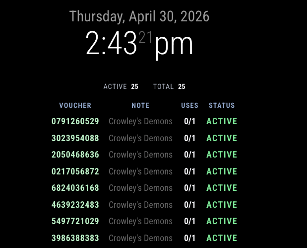

# MMM-UniFiHotspotVouchers

A [MagicMirror²](https://github.com/MagicMirrorOrg/MagicMirror)  module for displaying UniFi hotspot vouchers from a UniFi OS console running the Network application.

## Features

- Logs into UniFi OS with a local admin account
- Pulls hotspot vouchers from the Network application
- Tries the current UniFi OS proxy endpoints first, then falls back to legacy Network app paths
- Shows voucher code, note, usage, and status
- Supports optional compact mode, masking voucher codes, and inactive voucher display
- Refreshes update in place after the first render without flashing the module
- Refreshes on a configurable interval

## Screenshot



## Prerequisites

1. A working MagicMirror² installation.
2. A UniFi OS console such as a Cloud Key, UDM, or similar device.
3. A UniFi OS API key or local username/password with permission to read Network data.
4. An HTTPS URL for the UniFi OS console.

## Installation

MMPM is optional. You can use the standard Git method below without MMPM.

If you want to use MMPM commands, install MMPM first by following the official instructions:
<https://github.com/Bee-Mar/mmpm>

### Option 1: Standard Install (Git)

From your MagicMirror `modules` folder:

```bash
git clone https://github.com/rroach3753/MMM-UniFiHotspotVouchers.git
cd MMM-UniFiHotspotVouchers
npm install
```

If you copied this folder manually, place it at:

```text
MagicMirror/modules/MMM-UniFiHotspotVouchers
```

### Option 2: Install with MMPM (MagicMirror Package Manager)

If you use MMPM, install with:

```bash
mmpm install MMM-UniFiHotspotVouchers
```

## Updating

### Option 1: Standard Update (Git)

From your module folder:

```bash
cd MagicMirror/modules/MMM-UniFiHotspotVouchers
git pull
npm install
```

### Option 2: Update with MMPM

```bash
mmpm update MMM-UniFiHotspotVouchers
```

## Configuration

### Basic Config Example (Quick Start)

Configure the trusted controller URL and credentials in the environment of the
MagicMirror server process:

```bash
export UNIFI_HOTSPOT_URL="https://unifi.local"
export UNIFI_HOTSPOT_API_KEY="your_api_key"
```

For local-login authentication, set both of these instead of (or in addition
to) the API key:

```bash
export UNIFI_HOTSPOT_USERNAME="your_username"
export UNIFI_HOTSPOT_PASSWORD="your_password"
```

Then add this module block to your MagicMirror `config/config.js` file:

1. Install the module in your `MagicMirror/modules` folder.
2. Add this module block to the modules array in `config/config.js`.
3. Save and restart MagicMirror.

```js
{
  module: "MMM-UniFiHotspotVouchers",
  position: "top_right",
  config: {}
},
```

Restart MagicMirror after setting the environment variables. Connection and
authentication settings are accepted only from the server environment and are
never sent through the browser renderer.

## Example Config

Add this to your `config/config.js` file:

```js
{
  module: "MMM-UniFiHotspotVouchers",
  position: "top_right",
  config: {
    title: "Hotspot Vouchers",
    site: "default",
    refreshInterval: 300000,
    requestTimeout: 10000,
    showInactive: false,
    showSummary: true,
    showNotes: true,
    showCreatedAt: false,
    showVoucherCode: true,
    maskVoucherCode: false,
    sortBy: "created",
    maxRows: 12,
    compact: false,
    showBorders: true,
    showBackground: true,
    debug: false,
  },
},
```

## Configuration Options

Server connection and authentication values must be provided using the
environment variables in the next section. Renderer options are optional and
fall back to the defaults shown below.

| Option | Type | Required? | Default | What it does |
| --- | --- | --- | --- | --- |
| `title` | String | No | `UniFi Hotspot Vouchers` | Title shown above the voucher table. |
| `site` | String | No | `default` | Network application site name. Most single-site deployments use `default`. |
| `refreshInterval` | Number | No | `300000` | Refresh interval in milliseconds, clamped from 30000 through 2147483647. |
| `showInactive` | Boolean | No | `false` | Shows inactive, disabled, and used vouchers instead of only active ones. |
| `showSummary` | Boolean | No | `true` | Shows the summary chips for active and total vouchers. |
| `showNotes` | Boolean | No | `true` | Shows the voucher note/label column. |
| `showCreatedAt` | Boolean | No | `false` | Shows the voucher creation timestamp column. |
| `showVoucherCode` | Boolean | No | `true` | Shows the voucher code column. |
| `maskVoucherCode` | Boolean | No | `false` | Masks voucher codes in the table instead of showing the full code. |
| `sortBy` | String | No | `created` | Sort order for vouchers. Use `created` or `code`. |
| `maxRows` | Number | No | `12` | Maximum number of voucher rows shown. |
| `compact` | Boolean | No | `false` | Uses tighter spacing and smaller table padding. |
| `showBorders` | Boolean | No | `true` | Shows or hides the border and shadow around the voucher card. |
| `showBackground` | Boolean | No | `true` | Shows or hides the translucent card background behind the voucher table. |
| `requestTimeout` | Number | No | `10000` | Request timeout in milliseconds, clamped from 1000 through 2147483647. |
| `debug` | Boolean | No | `false` | Enable debug logging to browser console and server logs for troubleshooting. |
| `emptyMessage` | String | No | `No hotspot vouchers found.` | Message shown when no vouchers match the current filter. |
| `loadingMessage` | String | No | `Loading UniFi vouchers...` | Message shown while the first fetch is in progress. |

## Security Considerations

This module communicates with your UniFi OS console, which requires proper security practices:

### Server Environment Configuration

| Variable | Required? | What it does |
| --- | --- | --- |
| `UNIFI_HOTSPOT_URL` | Yes | Trusted HTTPS controller origin. Paths, queries, fragments, and embedded credentials are rejected. |
| `UNIFI_HOTSPOT_API_KEY` | Conditional | Server-only API key. Use this, username/password, or both. |
| `UNIFI_HOTSPOT_USERNAME` | Conditional | Server-only local-login username. Must be paired with the password. |
| `UNIFI_HOTSPOT_PASSWORD` | Conditional | Server-only local-login password. Must be paired with the username. |
| `UNIFI_HOTSPOT_API_KEY_HEADER` | No | API-key header name. Defaults to `X-API-Key`. |
| `UNIFI_HOTSPOT_VERIFY_SSL` | No | Certificate verification setting. Defaults to `true`; set `false` only for a trusted self-signed controller. |

The shared fallback names `UNIFI_URL`, `UNIFI_API_KEY`, `UNIFI_USERNAME`, and
`UNIFI_PASSWORD` remain supported. Authentication mode is inferred: an API key
is tried directly, username/password uses login, and configuring both allows
login fallback only when API-key requests fail. A successful response with no
vouchers does not trigger fallback.

### SSL/TLS Certificate Verification

- Authenticated controller requests require HTTPS; plaintext HTTP is rejected.
- TLS certificate verification is enabled by default.
- Prefer installing the controller CA in the MagicMirror host trust store.
- For a trusted local self-signed controller only, set
  `UNIFI_HOTSPOT_VERIFY_SSL=false`.

### Credentials Management

- Keep environment/service files containing credentials readable only by the
  MagicMirror service account.
- Ensure backups and process-manager configuration containing credentials are
  stored securely.
- If available, prefer API keys over username/password:
   - API keys provide more granular permission control
   - Easier to rotate without changing user accounts

### Network Security

- The module connects to a single server-controlled canonical HTTPS origin.
- Renderer configuration cannot change the controller target.
- Keep your UniFi controller and MagicMirror on a secure, private network
- Do not expose your UniFi controller to the public internet without proper VPN/firewall protection

### Sensitive Data Display

- Set `maskVoucherCode: true` if you want to hide full voucher codes on the physical mirror display
- Credentials are never included in renderer socket configuration or displayed
  on screen.
- Controller response bodies and internal error details are not sent to the
  renderer.
- Debug logging reports stable error categories and HTTP status codes, not
  controller response bodies or authentication material.

## Migration from Renderer Credentials

Versions that accepted `controllerUrl`, `username`, `password`, `apiKey`,
`apiKeyHeader`, `authMode`, or `verifySSL` in `config/config.js` exposed those
values to the renderer process. These keys are now ignored by the helper.

Before restarting after an upgrade:

1. Move `controllerUrl` to `UNIFI_HOTSPOT_URL`. It must use `https://`.
2. Move `apiKey` to `UNIFI_HOTSPOT_API_KEY`, or move `username` and `password`
   to their matching `UNIFI_HOTSPOT_*` variables.
3. If needed, move `apiKeyHeader` to `UNIFI_HOTSPOT_API_KEY_HEADER`.
4. If a trusted self-signed certificate requires it, replace
   `verifySSL: false` with `UNIFI_HOTSPOT_VERIFY_SSL=false`.
5. Remove all connection and authentication keys from the module block.
6. Restart the complete MagicMirror server process so it receives the new
   environment.

The helper fails closed with a generic configuration error if the trusted HTTPS
origin or server-side credentials are missing.

## Notes

- The module first tries UniFi OS proxy endpoints such as `/proxy/network/api/s/default/rest/hotspot/voucher`.
- If that fails, it falls back to the older Network app endpoints such as `/api/s/default/stat/voucher`.
- If both server-side authentication methods are configured, the module tries
  the API key first and uses login only after an API request failure.
- If your Cloud Key uses a self-signed certificate and trust cannot be
  configured in Node.js, set `UNIFI_HOTSPOT_VERIFY_SSL=false` only on a trusted
  local network.
- If you want to display expired vouchers for audit purposes, set `showInactive: true`.
- If you want to avoid exposing full voucher codes on the mirror, set `maskVoucherCode: true`.
- If you want a cleaner mirror look, set `showBorders: false`, `showBackground: false`, or both.
- Legacy keys such as `showExpiryColumn` and `warningHours` are ignored and can be removed from existing configs.

## Behavior Tips

- `sortBy: "created"` is usually the most useful view for voucher inventory monitoring.
- `showSummary: true` is good when you want a quick count of active and total vouchers.
- `compact: true` is a better fit for narrow mirror layouts.

## Troubleshooting

- **Configuration errors:** Confirm `UNIFI_HOTSPOT_URL` is an HTTPS origin and
  that a complete server-side authentication method is configured.
- **Authentication errors:** Confirm the environment username/password can log
  into UniFi OS or that the API key can read Network data.
- **API key issues:** Confirm the key belongs to an account that can read the
  Network application.
- **Intermittent 403 Forbidden errors:** The module should now re-authenticate once automatically; if it persists, verify the UniFi user or API key still has permission to read voucher data.
- **No vouchers displayed:** Confirm the Network application site name and that hotspot vouchers exist for that site.
- **Certificate/SSL errors:** Prefer fixing the certificate chain; use
  `UNIFI_HOTSPOT_VERIFY_SSL=false` only for trusted local self-signed setups.
- **Module shows "Loading" indefinitely or hangs:**
  - The module will timeout after `requestTimeout` milliseconds (default 10000ms). If the controller is slow, increase this value.
  - Check that `UNIFI_HOTSPOT_URL` is correct and reachable on the network.
  - Enable `debug: true` to see sanitized endpoint and error-category logging.
- **Need to troubleshoot authentication or API calls:**
  - Enable `debug: true` to log endpoint attempts, stable error categories, and
    voucher counts without exposing controller response bodies.
  - Check the MagicMirror server logs for sanitized backend diagnostics.
  - Verify the UniFi controller is responding with `curl -k https://your-controller-url/api/s/default/stat/voucher` (replace with your actual URL and site).
